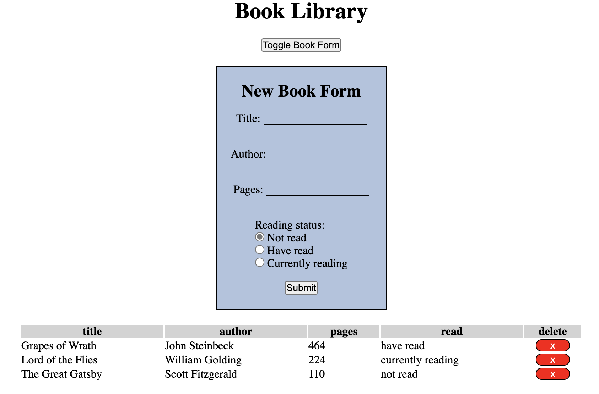

# The Odin Project - Book Library

This is a solution to the [Book Library](https://www.theodinproject.com/paths/full-stack-javascript/courses/javascript/lessons/library) challenge on [The Odin Project](https://www.theodinproject.com/).

## The challenge

Users should be able to:

- Add a “NEW BOOK” button that brings up a form allowing users to input the details for the new book: author, title, number of pages, whether it’s been read and anything else you might want.
- Add a button on each book’s display to remove the book from the library.
- Add a button on each book’s display to change its read status.

## Screenshot

## Links

- [Solution](https://github.com/LandonRGeorge/odin-library)
- [Live Site](https://landonrgeorge.github.io/odin-library/)

## Built with

- HTML
- CSS (including Flexbox)
- JavaScript